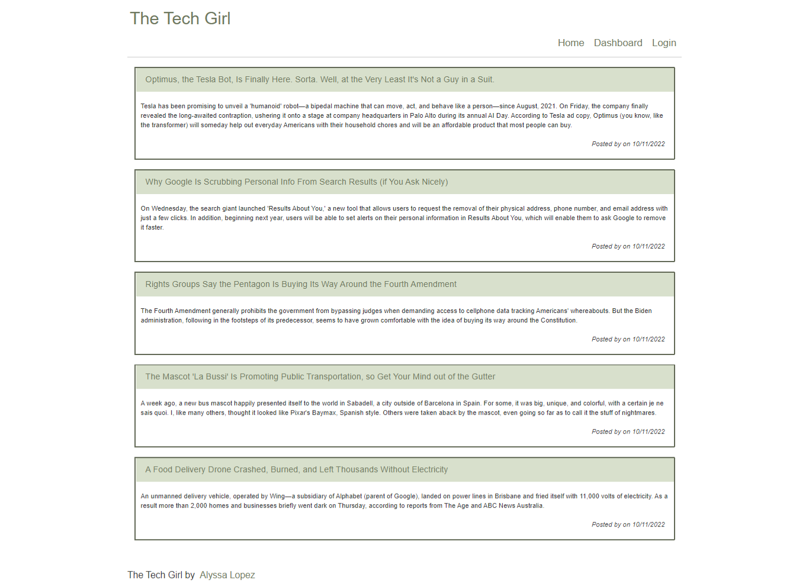

# MVC Tech Blog

Module 14: Model-View-Controller (MVC)

## Table of Contents
1. [Description](#description)
2. [Submission](#submission)
3. [Usage](#usage)
4. [Visuals](#visuals)

## Description
This application is a CMS-style blog site similar to a Wordpress site, where developers can publish their blog posts and comments on other developers' posts. It will follow the MVC paradigm in its architectural structure, using Handlebars.js as the template language, Sequalize as the ORM, and the expression-session npm package for authentication.

[GitHub Repo](https://github.com/alyssa20lopez/tech-blog)

## Submission

[Heroku Link](https://the-tech-girl.herokuapp.com/)
## Usage
To use this application, first clone the project and navigate to VS Code. The following packages were installed through the command-line:
- npm i express-handlebars
- npm i mysql2
- npm i sequelize
- npm i dotenv
- npm i bcrypt
- npm i express-session
- npm i connect-session-sequelize

## Visuals
Here is a visual of the front-end of the webpage design!

